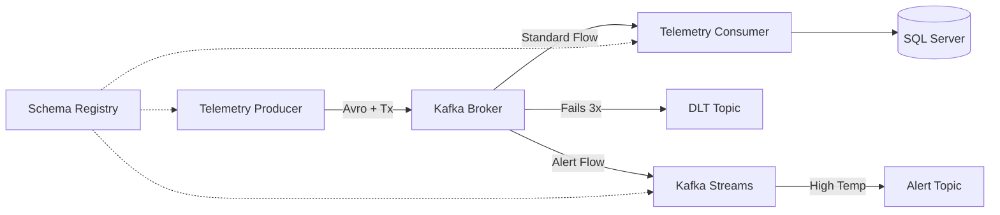

# Kafka Telemetry Architecture - Best Practices

This project demonstrates an enterprise-grade Kafka implementation for vending machine telemetry processing. It has been evolved from a basic setup to include advanced reliability, scalability, and monitoring features.

## 🚀 Key Features
- **Avro Serialization**: Compact binary format with schema enforcement via **Confluent Schema Registry**.
- **Exactly-Once Semantics (EOS)**: Producer configured with `idempotence` and `transactions` to prevent duplicates.
- **Consumer Resilience**:
    - **Dead Letter Topic (DLT)**: Automatic routing of failed messages to `.DLT` for investigation.
    - **Manual Acknowledgment**: Offsets are committed only after successful DB persistence.
    - **Retry Logic**: Configurable exponential backoff for transient failures.
- **Real-time Processing**: **Kafka Streams** processor for immediate temperature alerts.
- **Full Dockerization**: One-command deployment for the entire stack.

## 🛠 Tech Stack
- **Languages**: Java 8 (Eclipse Temurin)
- **Frameworks**: Spring Boot 2.7.18, Spring Kafka, Kafka Streams
- **Infrastructure**: Kafka (KRaft mode), Schema Registry, Kafka UI, SQL Server
- **Serialization**: Apache Avro

## 🏗 System Architecture


## 🚦 Getting Started

### 1. Setup Environment
Create a **`.env`** file in the root directory to store sensitive information:
```env
MSSQL_SA_PASSWORD=your_secure_password_here
```

### 2. Start Everything
Run the following command to build the Java apps and start the infrastructure:
```bash
docker-compose up -d --build
```

### 3. Verify Services
- **Kafka UI**: [http://localhost:8080](http://localhost:8080)
- **Telemetry Producer**: [http://localhost:8084](http://localhost:8084)
- **Schema Registry**: Port `8081` (Internal)

### 4. Test with Telemetry Data
Send a sample payload to the Producer:
```bash
curl -X POST http://localhost:8084/api/telemetry \
-H "Content-Type: application/json" \
-d '{
  "machineId": "VM-01",
  "temperature": 15.5,
  "inventory": {"Soda": 10, "Water": 5},
  "status": "OPERATIONAL"
}'
```

> [!NOTE]
> Since the temperature is > 10.0, the **Kafka Streams** processor will immediately generate an alert in the logs!

## 🔧 Database Configuration
The consumer automatically persists data to SQL Server. You can query the records via:
```bash
# Replace <your_password> with the value from your .env file
docker exec -it sqlserver /opt/mssql-tools18/bin/sqlcmd -S localhost -U sa -P "<your_password>" -C -d VendingDB -Q "SELECT * FROM vending_telemetry;"
```

## 🛠 Development & Building
To build locally (generating Avro classes):
```bash
mvn clean compile
```
The Java classes are generated from `src/main/resources/avro/telemetry.avsc`.

## 📈 Monitoring & Resilience
- **Transactions**: Configured via `spring.kafka.producer.transaction-id-prefix`.
- **DLT**: View failed messages in the `vending-telemetry.DLT` topic via Kafka UI.
- **Schema Management**: View and manage Avro schemas in the **Schema Registry** tab of the Kafka UI.

## 🐳 Docker Cheat Sheet

### Lifecycle
- **Start all services**: `docker-compose up -d`
- **Rebuild and restart**: `docker-compose up -d --build`
- **Stop services**: `docker-compose stop`
- **Stop and remove containers**: `docker-compose down`
- **Stop and remove containers + volumes (Warning: Data Loss)**: `docker-compose down -v`

### Inspection
- **Check container status**: `docker ps`
- **View app logs**: `docker-compose logs -f`
- **View specific logs**: `docker-compose logs -f telemetry-producer`
- **Check DB connectivity**: `docker exec -it sqlserver /opt/mssql-tools18/bin/sqlcmd -S localhost -U sa -P "your_password" -C -Q "SELECT 1"`

### Image Management
- **List all local images**: `docker images`
- **Remove a specific image**: `docker rmi <image_id_or_name>`
- **Remove all unused images**: `docker image prune`
- **Remove all unused containers, networks, and images**: `docker system prune`
- **Build image without using cache**: `docker-compose build --no-cache`

## 🐙 Git Cheat Sheet

### Setup & Basics
- **Initialize repo**: `git init`
- **Check status**: `git status`
- **Stage changes**: `git add .`
- **Commit changes**: `git commit -m "Your message"`

### Remote Operations
- **Add remote origin**: `git remote add origin <repo-url>`
- **Push to main**: `git push -u origin main`
- **Pull latest changes**: `git pull origin main`

### Hygiene & History
- **View commit history**: `git log --oneline --graph --all`
- **Check ignored files**: `git status --ignored`
- **Create branch**: `git checkout -b feature-name`
